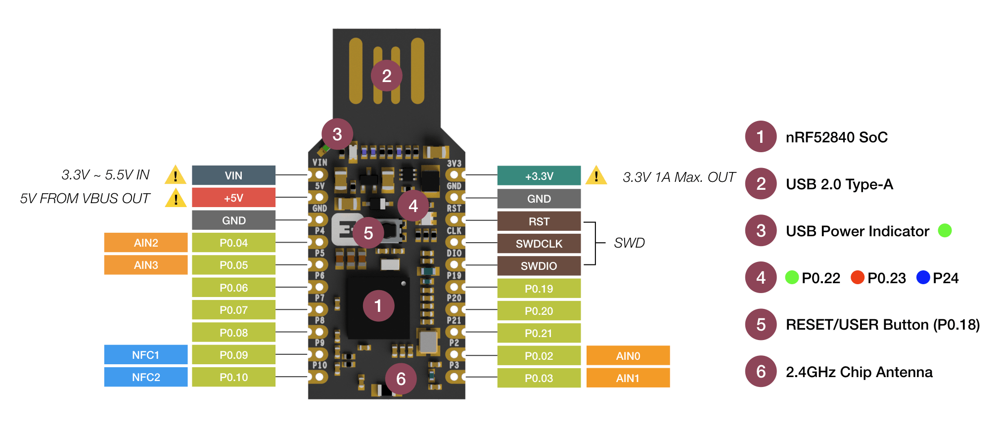

# Security Keys & WebAuthN

by Tillmann Weidinger [@Crabnebula](https://crabnebula.dev/)<br/>
and Martin Heidegger [@OWDDM](https://owddm.com)
<style>
footer {
  position: absolute;
  bottom: 2em;
  right: 2em;
}
</style>
<footer class="text-slate-300">
Kyoto, 2024/11/16
</footer>

---

# Todays Topics

<Toc />

---
hideInToc: false
---

# What are security keys?

---
hideInToc: false
---

{width=400px lazy}

- Hardware Device
- Stores Cryptographic Values
- Cost: between 4000円~25000円

---

<div class="flex flex-row items-center gap-9">

{width=300px lazy}

{width=100px lazy}

</div>

- Different makers
- Certified by a group

<!-- Make it yourself: https://www.wolfwithsword.com/hardware-diy-security-key/ -->

---

<div class="flex flex-row items-center gap-9">

{width=300px lazy}

{width=300px lazy}

</div>

- Different shapes
- Some with bio authenication

---

{width=600px lazy}

- Simple hardware
- [Protocol](https://fidoalliance.org/specs/FDO/FIDO-Device-Onboard-PS-v1.1-20220419/FIDO-Device-Onboard-PS-v1.1-20220419.html) supports basic cryptographic primitives

---

## Crypto features

- Attestion

    _Prove that a cryptographic key was generated on the device_

- Signatures

    _Create an asymetric key pair on the device and sign data with it._

- Encryption

    _Encrypt or decrypt data with PGP (slow and complicated)_

---
hideInToc: false
---

#  When and where are they useful?

---

<v-clicks depth="2">

- You don't want to remember passwords
    - ... you don't trust yourself to remember 😅
- You need something portable to authenticate
    - ... you don't trust the internet 🥸
- You have sensitive cryptographic needs
    - ... you need to comply 🫡
- You don't want to accidentially leak your credentials
    - ... you are clumsy 🤕

</v-clicks>

---

# How to handle the devices physically?

---
hideInToc: false
---

- Like physical keys
- Have pairs of keys (backups!)
- IP(X) ratings
- Keep them close to your body or safe at home

---

#  What is WebAuthN?

---
layout: full
---


---
layout: full
---

## Browser API

<div class="flex w-100p">

```ts
navigator.credentials.create(...)
                {...}.store(...)
                {...}.get(...)
                {...}.preventSilentAccess()
```

</div>

---
layout: center
---

```ts
.create({...}):
  PublicKeyCredential
  | PasswordCredential
  | FederatedCredential
```

<v-clicks>

- ~~PasswordCredential~~ ... maybe later
- ~~FederatedCredential~~ ... (Still Experimental)
- **PublicKeyCredential** ... that is what we need!

</v-clicks>

---
layout: iframe
url: https://martinheidegger.github.io/crypto-playground/index.html#/asymetric
---

---
layout: full
---

<style>
.slidev-runner-output {
  font-size: 8px !important;
  line-height: 9px !important;
  overflow: scroll;
}
</style>

```ts {monaco-run} {autorun:false}
const credential = await navigator.credentials.create({
    publicKey: {
      rp: { name: "Github Pages" },
      challenge: Uint8Array.from("F88FCB68CB5", c => c.charCodeAt(0)),
      user: {
          id: Uint8Array.from("UZSL85T9AFC", c => c.charCodeAt(0)),
          name: "info@owddm.com",
          displayName: "OWDDM",
      },
      pubKeyCredParams: [{alg: -7, type: "public-key"}],
  }
});
console.log(credential)
```

---
layout: center
---

```ts
  rp: { name: "Github Pages", id: "martinheidegger.github.io" },
```

<v-clicks>

<div class="flex flex-row items-center gap-4 p-5 text-lg">
  <ruby>Public<rt>everyone can know this</rt></ruby>
  <ruby>Key<rt>binary data</rt></ruby>
  <ruby>Credential<rt>to verify</rt></ruby>
  <ruby>Rp <rt><em>of the</em> <abbr title="A Relying Party implementation typically consists of both some client-side script that invokes the Web Authentication API in the client, and a server-side component that executes the Relying Party operations and other application logic. Communication between the two components MUST use HTTPS or equivalent transport security, but is otherwise beyond the scope of this specification.">relying party</abbr></rt></ruby>
  <ruby>Entity<rt>(you can pass this around)</rt></ruby>
</div>

</v-clicks>

<v-clicks>

```ts
interface PublicKeyCredentialEntity {
    name: string;
}
interface PublicKeyCredentialRpEntity extends PublicKeyCredentialEntity {
    id?: string;
}
```

</v-clicks>
<v-clicks>

- `id` has to same as the **full** domain
- `name` is shown in the browser

</v-clicks>

---
layout: center
---

```ts
  challenge: Uint8Array.from("F88FCB68CB5", c => c.charCodeAt(0)),
```

<v-clicks>

- aka. _NONCE_
- (crypto graphically secure) Random Data
- Generated on the server for every request.

</v-clicks>
<v-click>

```ts
  challenge: crypto.getRandomValues(new Uint8Array(11)),
```

</v-click>


---
layout: center
---

```ts
user: {
    id: Uint8Array.from("UZSL85T9AFC", c => c.charCodeAt(0)),
    name: "info@owddm.com",
    displayName: "OWDDM",
},
```

<v-clicks>

- `id` is the important bit, with the same key and ID we can log in!
- `name` and `displayName` are decorative

</v-clicks>

---
layout: center
---

```ts
pubKeyCredParams: [{alg: -7, type: "public-key"}],
```

<v-clicks>

- A list of algorithms to that the server supports!
- Can be a problem if the algorithm is not supported by the key
- Preferrably two valid should be used

</v-clicks>

---
layout: full
---

### Algorithms

<sub>[IANA Cose Algorithms](https://www.iana.org/assignments/cose/cose.xhtml#algorithms)</sub>

<style>
  table {
    font-size: 0.6em;
  }
</style>

<div style="top: 8em; left: 0; bottom: 0; right: 0; position: absolute; overflow: scroll; padding: 2em; padding-top: 0;">

| Value | Name                                      | Description                                           |
|-------|-------------------------------------------|-------------------------------------------------------|
| -46   | HSS-LMS                                   | HSS/LMS hash-based digital signature                  |
| -45   | SHAKE256                                  | SHAKE-256 512-bit Hash Value                          |
| -44   | SHA-512                                   | SHA-2 512-bit Hash                                    |
| -43   | SHA-384                                   | SHA-2 384-bit Hash                                    |
| -42   | RSAES-OAEP w/ SHA-512                     | RSAES-OAEP w/ SHA-512                                 |
| -41   | RSAES-OAEP w/ SHA-256                     | RSAES-OAEP w/ SHA-256                                 |
| -40   | RSAES-OAEP w/ RFC 8017 default parameters | RSAES-OAEP w/ SHA-1                                   |
| -39   | PS512                                     | RSASSA-PSS w/ SHA-512                                 |
| -38   | PS384                                     | RSASSA-PSS w/ SHA-384                                 |
| -37   | PS256                                     | RSASSA-PSS w/ SHA-256                                 |
| -36   | ES512                                     | ECDSA w/ SHA-512                                      |
| -35   | ES384                                     | ECDSA w/ SHA-384                                      |
| -34   | ECDH-SS + A256KW                          | ECDH SS w/ Concat KDF and AES Key Wrap w/ 256-bit key |
| -33   | ECDH-SS + A192KW                          | ECDH SS w/ Concat KDF and AES Key Wrap w/ 192-bit key |
| -32   | ECDH-SS + A128KW                          | ECDH SS w/ Concat KDF and AES Key Wrap w/ 128-bit key |
| -31   | ECDH-ES + A256KW                          | ECDH ES w/ Concat KDF and AES Key Wrap w/ 256-bit key |
| -30   | ECDH-ES + A192KW                          | ECDH ES w/ Concat KDF and AES Key Wrap w/ 192-bit key |
| -29   | ECDH-ES + A128KW                          | ECDH ES w/ Concat KDF and AES Key Wrap w/ 128-bit key |
| -28   | ECDH-SS + HKDF-512                        | ECDH SS w/ HKDF - generate key directly               |
| -27   | ECDH-SS + HKDF-256                        | ECDH SS w/ HKDF - generate key directly               |
| -26   | ECDH-ES + HKDF-512                        | ECDH ES w/ HKDF - generate key directly               |
| -25   | ECDH-ES + HKDF-256                        | ECDH ES w/ HKDF - generate key directly               |
| -18   | SHAKE128                                  | SHAKE-128 256-bit Hash Value                          |
| -17   | SHA-512/256                               | SHA-2 512-bit Hash truncated to 256-bits              |
| -16   | SHA-256                                   | SHA-2 256-bit Hash                                    |
| -15   | SHA-256/64                                | SHA-2 256-bit Hash truncated to 64-bits               |
| -14   | SHA-1                                     | SHA-1 Hash                                            |
| -13   | direct+HKDF-AES-256                       | Shared secret w/ AES-MAC 256-bit key                  |
| -12   | direct+HKDF-AES-128                       | Shared secret w/ AES-MAC 128-bit key                  |
| -11   | direct+HKDF-SHA-512                       | Shared secret w/ HKDF and SHA-512                     |
| -10   | direct+HKDF-SHA-256                       | Shared secret w/ HKDF and SHA-256                     |
| -8    | EdDSA                                     | EdDSA                                                 |
| -7    | ES256                                     | ECDSA w/ SHA-256                                      |
| -6    | direct                                    | Direct use of CEK                                     |
| -5    | A256KW                                    | AES Key Wrap w/ 256-bit key                           |
| -4    | A192KW                                    | AES Key Wrap w/ 192-bit key                           |
| -3    | A128KW                                    | AES Key Wrap w/ 128-bit key                           |
| 1     | A128GCM                                   | AES-GCM mode w/ 128-bit key, 128-bit tag              |
| 2     | A192GCM                                   | AES-GCM mode w/ 192-bit key, 128-bit tag              |
| 3     | A256GCM                                   | AES-GCM mode w/ 256-bit key, 128-bit tag              |
| 4     | HMAC 256/64                               | HMAC w/ SHA-256 truncated to 64 bits                  |
| 5     | HMAC 256/256                              | HMAC w/ SHA-256                                       |
| 6     | HMAC 384/384                              | HMAC w/ SHA-384                                       |
| 7     | HMAC 512/512                              | HMAC w/ SHA-512                                       |
| 10    | AES-CCM-16-64-128                         | AES-CCM mode 128-bit key, 64-bit tag, 13-byte nonce   |
| 11    | AES-CCM-16-64-256                         | AES-CCM mode 256-bit key, 64-bit tag, 13-byte nonce   |
| 12    | AES-CCM-64-64-128                         | AES-CCM mode 128-bit key, 64-bit tag, 7-byte nonce    |
| 13    | AES-CCM-64-64-256                         | AES-CCM mode 256-bit key, 64-bit tag, 7-byte nonce    |
| 14    | AES-MAC 128/64                            | AES-MAC 128-bit key, 64-bit tag                       |
| 15    | AES-MAC 256/64                            | AES-MAC 256-bit key, 64-bit tag                       |
| 16-23 | Unassigned                                |                                                       |
| 24    | ChaCha20/Poly1305                         | ChaCha20/Poly1305 w/ 256-bit key, 128-bit tag         |
| 25    | AES-MAC 128/128                           | AES-MAC 128-bit key, 128-bit tag                      |
| 26    | AES-MAC 256/128                           | AES-MAC 256-bit key, 128-bit tag                      |
| 30    | AES-CCM-16-128-128                        | AES-CCM mode 128-bit key, 128-bit tag, 13-byte nonce  |
| 31    | AES-CCM-16-128-256                        | AES-CCM mode 256-bit key, 128-bit tag, 13-byte nonce  |
| 32    | AES-CCM-64-128-128                        | AES-CCM mode 128-bit key, 128-bit tag, 7-byte nonce   |
| 33    | AES-CCM-64-128-256                        | AES-CCM mode 256-bit key, 128-bit tag, 7-byte nonce   |

</div>

---
layout: full
---


```ts
await navigator.credentials.create({
  publicKey: {
    rp: { name: "Key Presentation" },
    challenge: Uint8Array.from("F88FCB68CB5", c => c.charCodeAt(0)),
    user: {
        id: Uint8Array.from("UZSL85T9AFC", c => c.charCodeAt(0)),
        name: "info@owddm.com",
        displayName: "OWDDM",
    },
    pubKeyCredParams: [{alg: -7, type: "public-key"}],
  },
})
```

<v-click>

```ts
PublicKeyCredential: {
  "type": "public-key"
  "authenticatorAttachment": "cross-platform",
  "clientExtensionResults": {},
  "id": "R3z..(80)..zUQ",
  "rawId": "R3z..(80)..zUQ",
  "response": {
    "attestationObject": "o2N..(296)..HjA",
    "authenticatorData": "S8g..(256)..HjA",
    "clientDataJSON": "eyJ..(156)..lfQ",
    "publicKey": "MFk..(116)..HjA",
    "publicKeyAlgorithm": -7,
    "transports": [
      "ble", "hybrid", "internal", "nfc", "usb"
    ]
  }
}
```

</v-click>

---

```ts
PublicKeyCredential: {
  "type": "public-key"
  "authenticatorAttachment": "cross-platform",
  "clientExtensionResults": {},
  "id": "R3z..(80)..zUQ",
  "rawId": "R3z..(80)..zUQ",
  "response": { /* ... */}
}
```

<v-clicks>

- `type` is fixed
- `clientExtensionResults` - Pandorras box
- `authenticatorAttachment` - `cross-platform` (NFC keys, Bluetooth) or `platform` (direct)
- `id` (string) & `rawId` (ArrayBuffer) - ID for the credential the credential

</v-clicks>

---

### There are more options. 💪

<v-clicks>

- `attestation` & `attestationFormats` - privacy setting
- `authenticatorSelection` - Filter out unacceptable authenticators
  - `userVerification` - How much distraction for user is okay
- `excludeCredentials` - To avoid using the same key twice for the same account.
- `extensions` - Pandorra's Box (hope comes last)
- `timeout` - Suggested! timeout
- `hints` - `security-key` | `client-device` | `hybrid` <br/>
    What device do we prefer?

</v-clicks>

---

## Browser API

<div class="flex w-100p">

```ts
{...}.store(...)
{...}.get(...)
{...}.preventSilentAccess()
```

</div>

---

```ts
{...}.store(credentials)
```

- Mostly for passwords and federated login.
- Prevents repeat use of keys

---
hideInToc: false
---

#  What is the most common example for using security keys?

- Authentication
  - SSH
  - Git
  - Physical Doors

---
hideInToc: false
---

#  How can I use security keys to improve my work?

---

#  Q&A: Are security keys a useful technology?
